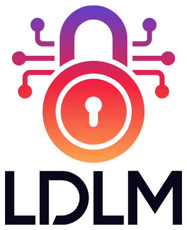

====================
LDLM
====================

.. centered::
    version - |release|

.. centered::
	Lightweight Distributed Lock Manager   

Contents
----------

.. toctree::
    :maxdepth: 2
    :caption: LDLM

    /overview
    /concepts
    /uses
    /contributing
    /license

.. toctree::
    :maxdepth: 2
    :caption: Server

    /server/usage
    /server/configuration
    /server/api

.. toctree::
    :maxdepth: 2
    :caption: Native Clients

	Go </go/index>
    Python </py/index>

Disclaimer
--------------------

This project is not an official Google project. It is not supported by Google and Google
specifically disclaims all warranties as to its quality, merchantability, or fitness for a
particular purpose. 
